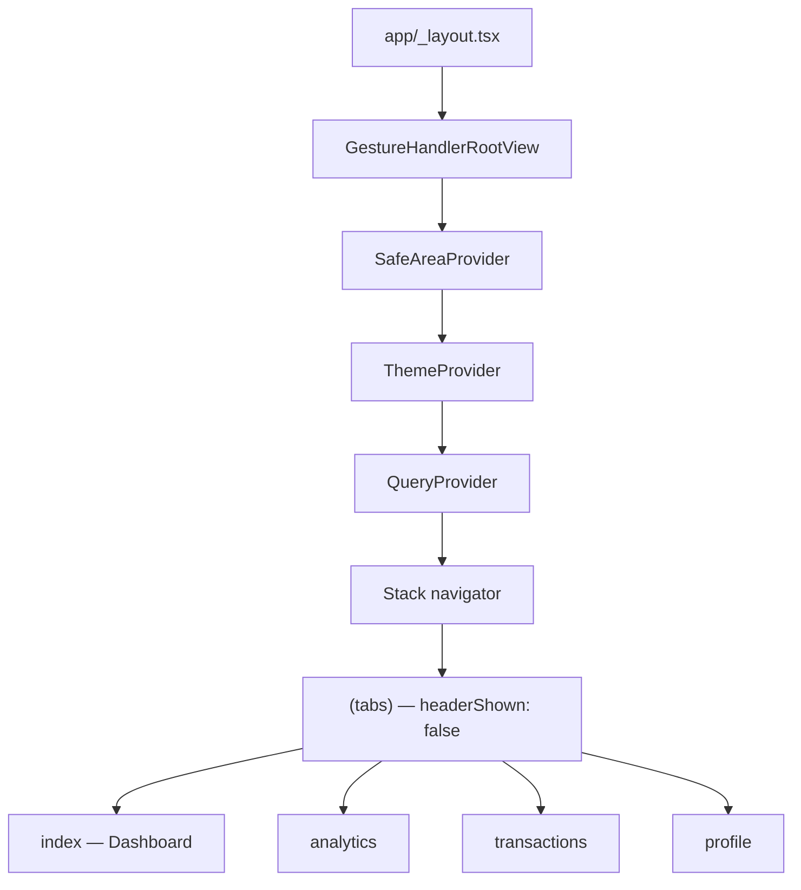
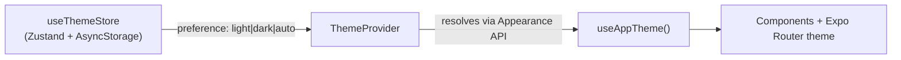
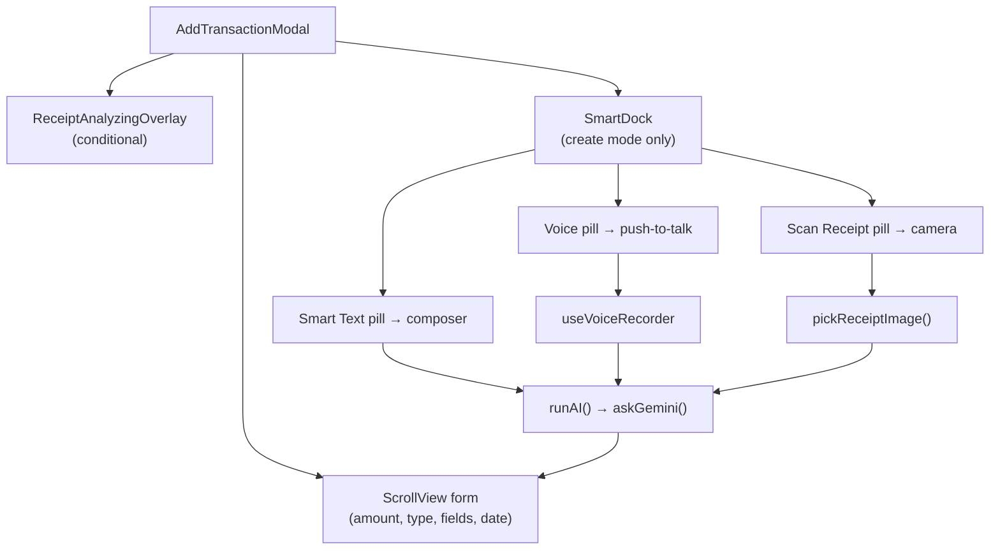

# BudgetAIapp — Project State & Architecture Report

> **Last updated:** August 2026  
> **Scope:** Full codebase analysis (`apps/mobile`, `apps/web`, `packages/shared`, `supabase/migrations`)

---

## 1. Tech Stack & Dependencies

### Monorepo Layout

| Path | Role |
|------|------|
| [`apps/mobile/`](../apps/mobile/) | Primary product — React Native (Expo SDK 57) |
| [`apps/web/`](../apps/web/) | Next.js 16 finance API proxy (Yahoo Finance search/quote routes) |
| [`packages/shared/`](../packages/shared/) | Shared TypeScript library consumed by mobile (`@budgetaiapp/shared`) |
| [`supabase/migrations/`](../supabase/migrations/) | Incremental SQL migrations only (base schema lives in hosted Supabase) |

**Workspace tooling:** npm workspaces (`apps/*`, `packages/*`), TypeScript project references, `patch-package` for `react-native-reorderable-list`. No Turbo/Nx.

### Core Libraries (Mobile)

| Library | Version (approx.) | Role |
|---------|-------------------|------|
| **Expo** | ^57.0.14 | Runtime, native modules, build tooling |
| **Expo Router** | ~57.0.14 | File-based navigation (Stack + Tabs) |
| **React / React Native** | 19.2.3 / 0.86.2 | UI framework |
| **@supabase/supabase-js** | ^2.112.3 (via shared) | Postgres client, auth-ready session storage |
| **@tanstack/react-query** | ^5.101.4 | Server state, caching, mutations |
| **Zustand** | ^5.0.15 | Client state (theme preference, app store) |
| **react-native-reanimated** | 4.5.1 | 60fps animations (Smart Dock, overlays, FAB) |
| **react-native-gesture-handler** | ~2.32.0 | Swipe gestures on transaction rows |
| **i18n-js + expo-localization** | ^4.5.3 / ~57.0.1 | Multi-language (en, tr, nl, es) with English fallback |
| **Supabase Edge Function** | `ask-gemini` | Gemini multimodal AI (voice, text, receipt), key held server-side |
| **expo-audio** | ~57.0.3 | Push-to-talk voice recording |
| **expo-image-picker** | ~57.0.13 | Camera/gallery receipt scanning |
| **expo-linear-gradient** | ~57.0.1 | Smart Dock pill gradients |
| **lucide-react-native** | ^1.32.0 | Icons |
| **@react-native-async-storage/async-storage** | 2.2.0 | Theme persistence + Supabase session storage |

**Note:** The project uses **`i18n-js`**, not `i18next`. Translations live in [`packages/shared/i18n/`](../packages/shared/i18n/).

### Web App (Secondary)

- **Next.js 16.3.1** + Tailwind CSS v4
- **TanStack Query + Zustand** (local providers, not wired to shared Supabase hooks)
- Finance routes: [`apps/web/app/api/finance/search/route.ts`](../apps/web/app/api/finance/search/route.ts), [`quote/route.ts`](../apps/web/app/api/finance/quote/route.ts)
- Does **not** depend on `@budgetaiapp/shared`

---

## 2. Architecture & Routing

### Folder Structure (Mobile)

```
apps/mobile/
├── app/                      # Expo Router entry points
│   ├── _layout.tsx           # Root: providers + Stack
│   └── (tabs)/
│       ├── _layout.tsx       # 4-tab bottom navigator
│       ├── index.tsx         # Dashboard
│       ├── analytics.tsx
│       ├── transactions.tsx
│       └── profile.tsx
├── src/
│   ├── components/           # UI (modals, Smart Dock, screens)
│   ├── hooks/                # useVoiceRecorder
│   ├── lib/                  # ai.ts, receiptPicker.ts, apiConfig
│   ├── providers/            # QueryProvider
│   ├── theming/              # ThemeProvider, tokens, useAppTheme
│   └── theme.ts              # spacing, radius, legacy light palette
```

[`packages/shared/`](../packages/shared/) exports: Supabase client, API modules, TanStack Query hooks, Zustand stores, i18n, types, utilities.

### Expo Router Configuration



**Key routing facts:**

- Root [`app/_layout.tsx`](../apps/mobile/app/_layout.tsx): wraps app in `GestureHandlerRootView` → `SafeAreaProvider` → `ThemeProvider` → `QueryProvider` → themed `Stack`.
- Only one stack screen: `(tabs)` with `headerShown: false`.
- **No programmatic routing** — no `router.push`, `Link`, or additional stack routes found.
- Secondary flows use React Native **`Modal`** overlays, not Expo Router screens.

### Navigation Flow

| User Action | Destination |
|-------------|-------------|
| Tab bar | Switch between Dashboard / Analytics / Transactions / Profile |
| Dashboard FAB (+) | `AddTransactionModal` (create) |
| Dashboard transaction row tap | `AddTransactionModal` (edit) |
| Dashboard gear icon | `OptionsModal` → Manage Accounts / Categories / Clear Data |
| Transactions row tap | `AddTransactionModal` (edit only — **no FAB on this tab**) |
| Transactions filter icon | `TransactionFilterSheet` |
| Profile theme picker | `setPreference('light' \| 'dark' \| 'auto')` |

---

## 3. Authentication & Database

### Supabase Auth — Current State: **Plumbing Only**

[`packages/shared/lib/supabase.ts`](../packages/shared/lib/supabase.ts) configures a singleton client with auth-ready settings:

- `storage: AsyncStorage`
- `autoRefreshToken: true`, `persistSession: true`
- `detectSessionInUrl: false` (React Native)

**Not implemented in codebase:**

- Login / signup / sign-out UI
- `getSession()` / `onAuthStateChange()` listeners
- Auth guards or protected routes
- `user_id` columns or query scoping
- RLS policies in migrations

The app launches directly into tabs with **no auth gate**. All queries use the **anon key** against shared tables.

**Env vars:** `EXPO_PUBLIC_SUPABASE_URL`, `EXPO_PUBLIC_SUPABASE_ANON_KEY` ([`.env.example`](../apps/mobile/.env.example))

### Database Schema (In-Repo View)

Three Supabase tables are actively queried. Base DDL is **not** in this repo; migrations are incremental only.

#### `assets`

Accounts and holdings metadata: `id`, `name`, `symbol`, `type` (`stock|etf|crypto|commodity|cash|card|bank|investment`), `icon`, `custom_color`, `sort_order`, `quantity`, `purchase_price`, `current_price`, `currency`, `created_at`.

#### `categories`

Spending/income categories: `id`, `name`, `icon`, `type`, `is_custom`, `translation_key`, `is_active`, `created_at`. Soft-delete via `is_active` ([`20260824_category_soft_delete.sql`](../supabase/migrations/20260824_category_soft_delete.sql)).

#### `transactions`

Financial events: `id`, `title`, `amount`, `currency`, `exchange_rate`, `type` (`income|expense|transfer`), `date`, `category_id`, `asset_id`, `to_asset_id`, `asset_symbol`, `shares`, `unit_price`, `installment_group_id`, `created_at`. Embeds `categories`, `assets!asset_id`, `assets!to_asset_id` in selects.

**Business rules encoded in types** ([`packages/shared/types/database.ts`](../packages/shared/types/database.ts)):

- Transfers use `accountId` / `toAssetId` — never categorized as income/expense
- Multi-currency via fixed `exchange_rate` at transaction time
- Investment transfers track `asset_symbol`, `shares`, `unit_price`

### API Layer & TanStack Query

Central hooks: [`packages/shared/api/queries.ts`](../packages/shared/api/queries.ts)

| Query Key | Hook | Notes |
|-----------|------|-------|
| `['transactions']` | `useTransactionsQuery()` | Secondary sort: `date DESC, created_at DESC`; computes `balanceByAsset`, `totalBalance` |
| `['assets']` | `useAssetsQuery()` | Sorted by `sort_order`, `created_at` |
| `['categories']` | `useCategoriesQuery()` | — |

**Mutations:** Create/update/delete for all three domains; batch transaction creation for installments; optimistic reorder for assets.

**Query defaults:** `staleTime: 30s`, `retry: 1`.

**Finance API (non-Supabase):** Mobile calls Next.js routes for asset search/quotes via [`packages/shared/config/apiConfig.ts`](../packages/shared/config/apiConfig.ts). Dev default `localhost:3000` requires `EXPO_PUBLIC_API_BASE_URL` on physical devices.

---

## 4. UI/UX & Theming Implementation

### Dynamic Light / Dark / Auto Mode



| File | Responsibility |
|------|----------------|
| [`packages/shared/store/useThemeStore.ts`](../packages/shared/store/useThemeStore.ts) | Persisted preference (`budgetaiapp.theme-preference`), default `auto` |
| [`apps/mobile/src/theming/ThemeProvider.tsx`](../apps/mobile/src/theming/ThemeProvider.tsx) | Resolves scheme, sets StatusBar, SystemUI, Android nav bar |
| [`apps/mobile/src/theming/tokens.ts`](../apps/mobile/src/theming/tokens.ts) | Semantic `lightColors` / `darkColors` tokens |
| [`apps/mobile/src/theming/index.ts`](../apps/mobile/src/theming/index.ts) | `useAppTheme()` hook |
| [`apps/mobile/app/_layout.tsx`](../apps/mobile/app/_layout.tsx) | Maps tokens into Expo Router `NavigationThemeProvider` |

**Rule:** Components use semantic tokens (`colors.background`, `colors.surface`, `colors.text`, `colors.brand`) — no hardcoded `#fff` / `#000`. Layout constants (`spacing`, `radius`, `TOUCH_TARGET`) remain in [`apps/mobile/src/theme.ts`](../apps/mobile/src/theme.ts).

**User control:** Profile screen 3-segment picker (Auto / Light / Dark).

### New Transaction Modal & Unified AI Hub (Smart Dock)

**Primary file:** [`apps/mobile/src/components/AddTransactionModal.tsx`](../apps/mobile/src/components/AddTransactionModal.tsx) (~1950 lines)



#### AddTransactionModal

- Full-screen RN `Modal` with header (Cancel / Save)
- Manual form: amount hero, type tabs, currency/asset/category/date/installments, investment holding block
- AI state: `aiInput`, `isParsing`, `isScanningReceipt`, `isAIBusy = isParsing || isProcessing`
- **Edit mode:** Smart Dock hidden; manual correction only
- **Confirm overlay:** When AI returns `action: 'save'` and validation passes

#### SmartDock ([`apps/mobile/src/components/SmartDock.tsx`](../apps/mobile/src/components/SmartDock.tsx))

Presentational only — no AI logic. Three gradient pills:

| Pill | Color (light/dark gradients) | Behavior |
|------|------------------------------|----------|
| Smart Text | Blue/Purple | Expands to inline composer with Send |
| Voice | Red/Pink | Push-to-talk (`onPressIn`/`onPressOut`) |
| Scan Receipt | Teal/Green | Opens `expo-image-picker` |

**Interactive states:**

- `isRecording`: Non-interactive listening overlay (pulsing mic + waveform) above stable voice touch target
- `isVoiceProcessing`: Pills replaced by centered spinner + "AI is analyzing your voice..." (i18n)
- `isBusy`: Pills disabled (text parse or other AI work)

**Voice stability fix:** Stable callback refs + overlay pattern prevents premature `onPressOut` during hold-to-talk.

#### ReceiptAnalyzingOverlay ([`apps/mobile/src/components/ReceiptAnalyzingOverlay.tsx`](../apps/mobile/src/components/ReceiptAnalyzingOverlay.tsx))

- Themed skeleton/shimmer over form fields
- Shown during receipt scan (`isScanningReceipt`) or voice processing (`isProcessing`)
- Optional `title` prop for context-specific microcopy

#### Dashboard FAB ([`apps/mobile/app/(tabs)/index.tsx`](../apps/mobile/app/(tabs)/index.tsx))

- Fixed 56×56 `Pressable`, bottom-right, `colors.brand`, `Plus` icon
- Opens `AddTransactionModal` for new transactions
- Separate gear button opens `OptionsModal` (accounts/categories management)

---

## 5. AI & Business Logic

### Central Pipeline (`AddTransactionModal.runAI`)

All three AI inputs converge on one function:

```
runAI(parts)
  → askGemini(parts)                    # → ask-gemini Edge Function → Gemini
  → parseTransactionResponse(...)       # JSON → TransactionValues
  → applyValues(values)                 # Populate form fields
  → if action === 'save' → confirm → saveTransaction()
  → if action === 'cancel' → onClose()
```

### Voice Recording

**Hook:** [`apps/mobile/src/hooks/useVoiceRecorder.ts`](../apps/mobile/src/hooks/useVoiceRecorder.ts)

- **expo-audio** with `RecordingPresets.HIGH_QUALITY` (Android: mono 16kHz override)
- Push-to-talk: `start()` on press-in, `stop()` on press-out
- Max 60s; `cancel()` on modal dismiss
- Returns `{ base64, mimeType: 'audio/mp4' }` via `onFinish`
- `isProcessing` true from stop until `onFinish` completes

**Wiring:** SmartDock `onVoicePressIn/Out` → `startRecording/stopRecording` → `onFinish` → `runAI([audioPart, buildTransactionPrompt(...)])`

### Receipt Scanning

**Module:** [`apps/mobile/src/lib/receiptPicker.ts`](../apps/mobile/src/lib/receiptPicker.ts)

- Camera first (with permission), falls back to photo library (simulator-friendly)
- Returns `{ base64, mimeType }` or `null` on cancel
- Sets `isScanningReceipt` during API call

**Wiring:** SmartDock scan pill → `handleScanReceipt()` → `pickReceiptImage()` → `runAI([imagePart, buildTransactionPrompt(...)])`

### AI Text Parsing (Gemini)

**Module:** [`apps/mobile/src/lib/ai.ts`](../apps/mobile/src/lib/ai.ts)

| Function | Purpose |
|----------|---------|
| `askGemini(parts)` | Invokes the `ask-gemini` Edge Function via `supabase.functions.invoke`; returns the model's raw JSON text |
| `buildTransactionPrompt(categories, assets, userText?)` | System prompt with accounts, categories, transfer/investment/installment rules |
| `parseTransactionResponse(...)` | Parses JSON → `AIResult { action, values }` |

**Key parsing logic:**

- Category/asset fuzzy matching with Turkish fallback `'Diğer'`
- Transfer detection (never income/expense)
- Installment plans up to `MAX_INSTALLMENTS` (60)
- Currency normalization (EUR/USD/GBP/TRY + spoken aliases)

### Gemini Proxy (Edge Function)

**Module:** [`supabase/functions/ask-gemini/index.ts`](../supabase/functions/ask-gemini/index.ts)

The API key lives only here, as the `GEMINI_API_KEY` Supabase secret — the mobile
bundle no longer contains it. The function holds the model list
(`gemini-flash-latest` → `gemini-flash-lite-latest` fallback on 503/429),
`temperature: 0`, and the JSON response mode, and returns `{ text }` for the
client to parse.

**Secret:** `supabase secrets set GEMINI_API_KEY=...`

### State Wiring Summary

| State | Source | UI Effect |
|-------|--------|-----------|
| `isRecording` | `useVoiceRecorder` | SmartDock listening overlay |
| `isProcessing` | `useVoiceRecorder` | SmartDock processing state + form skeleton overlay |
| `isParsing` | `AddTransactionModal` | `isAIBusy` disables dock; **no form overlay** |
| `isScanningReceipt` | `AddTransactionModal` | Form skeleton overlay |

---

## 6. Technical Debt & Incomplete Features

### Authentication & Multi-User

- No auth UI, session listeners, or route guards
- No `user_id` scoping; RLS not defined in repo
- Profile shows placeholder name (`profile.namePlaceholder`) — no user identity

### Web App Gap

- Web does not consume `@budgetaiapp/shared` or Supabase
- Duplicate local QueryProvider; finance API only

### i18n Gaps

- **nl.ts / es.ts:** Partial translations (Smart Dock keys + categories only); fallback to English via `i18n.enableFallback = true`
- Legacy unused keys: `addWithAI`, `addWithAIHint` (replaced by Smart Dock keys)
- Hardcoded English in [`packages/shared/lib/api/finance.ts`](../packages/shared/lib/api/finance.ts): `'Asset search is temporarily unavailable.'`
- AI category fallback hardcoded to Turkish `'Diğer'` in [`ai.ts`](../apps/mobile/src/lib/ai.ts)

### AI / UX Gaps

- **Text parse loading:** `isParsing` disables dock but does not show `ReceiptAnalyzingOverlay` (inconsistent with voice/receipt)
- **No receipt-specific prompt:** Vision uses generic financial-assistant prompt
- **Camera denied:** Silently falls back to photo library without user notification

### Theming Migration

- Dual systems: static [`theme.ts`](../apps/mobile/src/theme.ts) vs semantic [`theming/tokens.ts`](../apps/mobile/src/theming/tokens.ts)
- Migration in progress; spacing/radius still imported from `theme.ts`

### Placeholder Features

- Profile "Premium" badge — no subscription logic
- Empty [`apps/mobile/src/context/`](../apps/mobile/src/context/) directory (unused)
- Settings gear still on Dashboard (Profile does not yet host OptionsModal)

### Database / Repo Gaps

- Base Supabase schema not versioned in repo (migrations note this explicitly)
- No `.limit()` on queries (by design per project rules)

### No Explicit TODO Comments

Grep across `*.ts` / `*.tsx` found **zero** `TODO`, `FIXME`, or `HACK` markers — debt is implicit rather than annotated.

### Recent In-Progress Work (Uncommitted)

Smart Dock refactor files include:

- `SmartDock.tsx`, `ReceiptAnalyzingOverlay.tsx`, `receiptPicker.ts`
- Voice processing UX (`isVoiceProcessing` state, i18n keys)
- `useVoiceRecorder.ts` ref fix for hold-to-talk stability

---

## Report Metadata

| Field | Value |
|-------|-------|
| **Generated from** | Full codebase analysis (apps/mobile, apps/web, packages/shared, supabase/migrations) |
| **Expo SDK** | 57 |
| **React Native** | 0.86.2 |
| **React** | 19.2.x |
| **Primary product surface** | Mobile app with Gemini-powered transaction entry |
